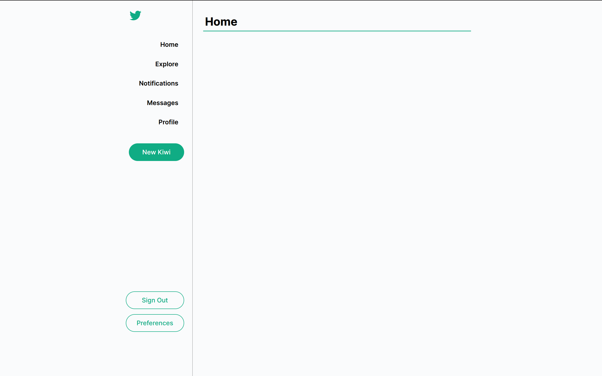
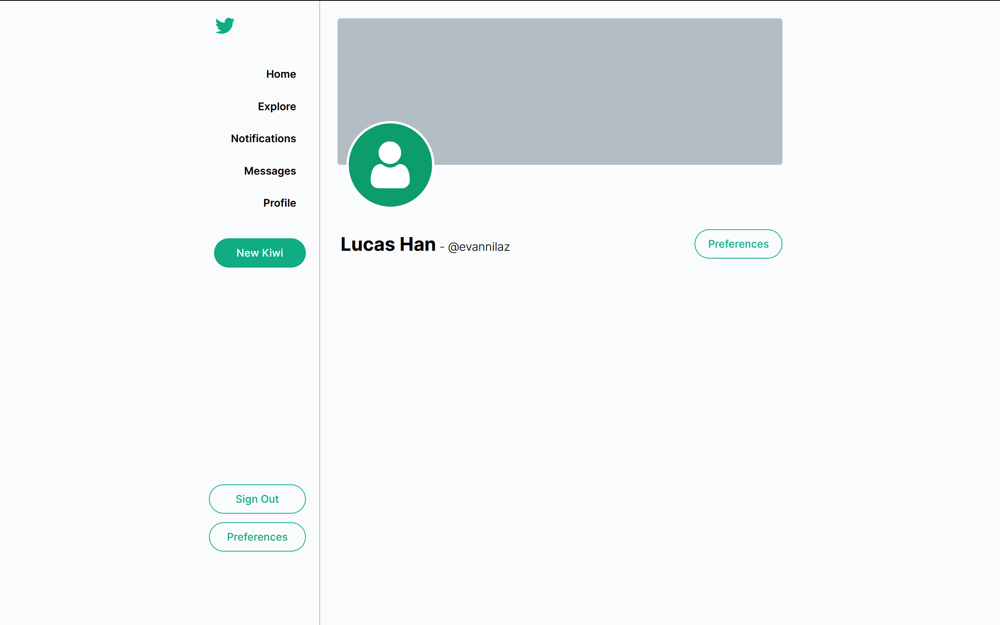
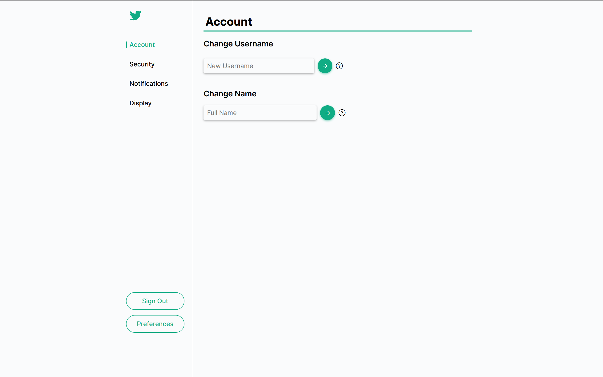
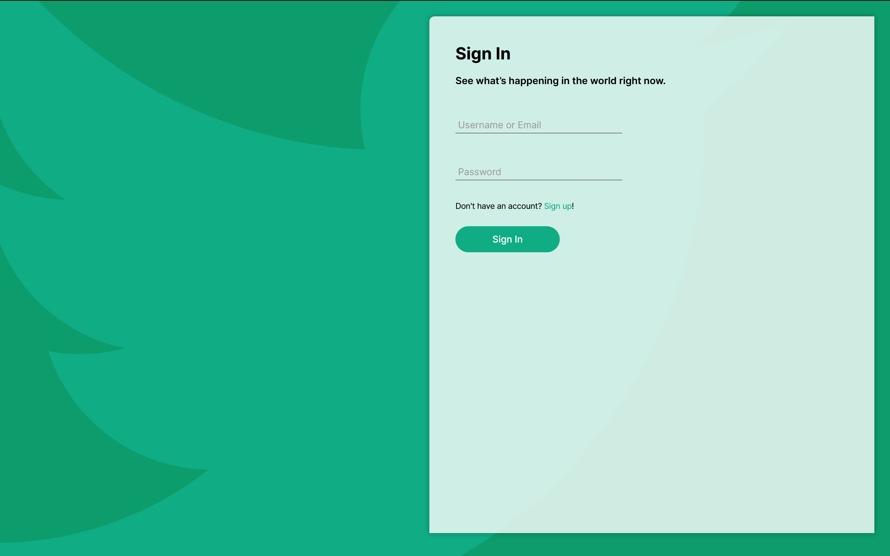
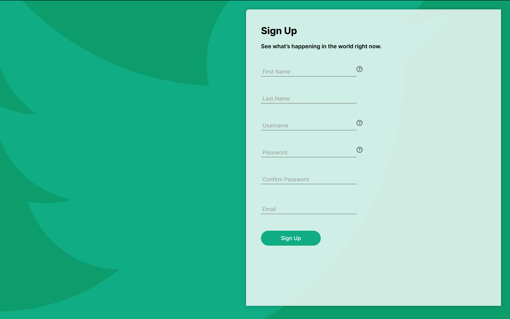

# Kiwitter

Kiwitter: Clone of Twitter

## Overview

### Used Techs

- TypeScript
- HTML / CSS / JS
- Node.js
- Express

### Dependencies

Reference at [`package.json`](package.json).

### Intentions

Just for practice

### License

No license. Ignore the one at `package.json`.

## How to View It?

No way to view it. Just a private project for myself. I may offer some previews.

### Preview Images

